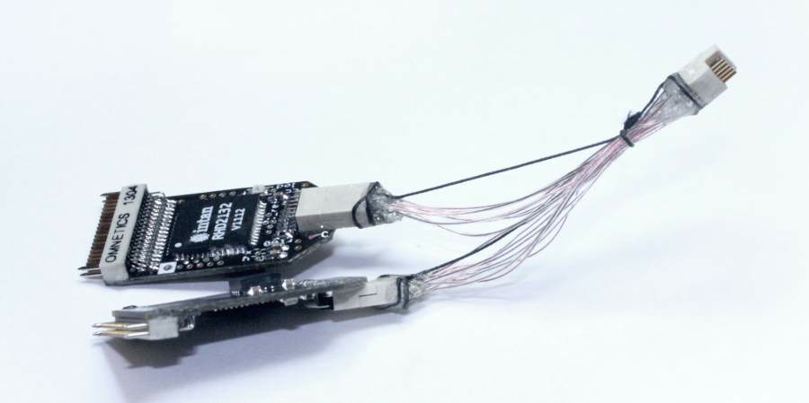

.. _custom_cables:

***********************************
Custom Cables
***********************************

Some of the required cables can be built in the lab:

Custom fine wire tether
-----------------------------------
If you want something even more lightweight and flexible, it's possible to build your own cables. We did this by soldering wires to two 12-pin Omnetics PZN-12 `polarized nano connectors <https://www.omnetics.com/products/polarized-nano>`__. Here, we've used `Cooner <http://www.coonerwire.com/>`__ CZ 1187 wire, FEP Insulation 38AWG with 0.012" diameter and 0.720Ω/foot. This is the standard wire for analog tethers because it is very flexible and light, but also durable. The cables sold by Intan are 0.423Ω/ft for the LVDS and 0.172Ω/ft for ground and power, so we're at the upper end of the possible resistance values, but it seems possible that the 40AWG version of the wire could work for the LVDS pairs. For the GND and VCC traces using two 38AWG wires or going to a thicker wire with <0.2Ω/foot is recommended unless the tether is pretty short. This limit is more unforgiving if you're intending to run two headstages on one cable.

The wiring diagram of the cable is simple: There are two rows, each with 6 conductors. Each pair consists of a 'top' and 'bottom' conductor which must be wired straight to the same pair, except with the top and bottom cables switched at the opposite end. Alternatively, as shown below, if one connector is flipped upside down, then all wires just go straight to the opposing pin. This includes gnd/power.

So, if one connector is laid facing the other back-to-back and one connector is upside-down, each pin needs to be connected with its opposite pin (see illustration below). The gnd/power wires looks different in the illustration because they're not twisted - but no wires should be switched top/bottom if the connectors are flipped as shown in the illustration.

.. image:: ../_static/images/usermanual/cables/lvds_tether_illustration2.png
  :align: center

Each tether will need 12 conductors total: 5 LVDS pairs, plus power and ground. To begin, securely clamp one of the connectors so there's enough space to lay out wires in front of it. Measure out 12 equal lengths of wire.

Now for each LVDS pair, de-insulate ~1 mm on one end of a wire (sharp forceps work well for the cooner wire), tin the wire, and solder it to one pin on the connector. Use plenty of flux when dealing with small wires like these and solder quickly to avoid heating up the plastic body of the connector.  Attach a label to one of the wires in each pair indicating the number (1-6) and which wire is top or bottom.

For each LVDS pair, twist the wires (top and bottom) until they maintain contact even when the tether is bent. Don't simply twist both wires together so that they remain under tension - instead move one wire around the other, without twisting each of the individual wires. Otherwise, the tether will twist around itself later. The ground and power wires don't need to be twisted.

.. image:: ../_static/images/usermanual/cables/lvds_tether_soldered.jpg
  :align: center

Once all wires on one connector are soldered, fix the tether to the table with standard lab tape or Kapton tape about 1 cm from the connector. This way you can gently pull on the wires to ensure they are the same length, without the risk of breaking the solder joints. Next, lay out the tether so that the free end with the labelled wire ends can be soldered to the 2nd connector.

Make sure the tether is straight and that all wires are tightly twisted with no open loops. Fix the free end to the table with another piece of tape, so that its easy to cut individual wires to the same length, and solder them to the 2nd connector. Make sure that all LVDS pairs remain well-twisted, and add a few more twists on the free end where needed.

After soldering, carefully connect the tether to the acquisition system and headstage and verify that it's working. Use a 64 channel headstage or a 2-to-1 adapter to test both of the 32 channel data lines.

Remove the flux from the connectors with ethanol, and secure the solder joints with a thin coat of epoxy. Tie the wires together at the connectors, and at regular intervals throughout the cable. Add some more epoxy to the knot at each connector and to the sides of the connector to make a solid connection that can withstand handling.

For added strength, it might be useful to add a thin string in parallel with the wires.

Et voilà, 64 channels of neural data on a tether even lighter than those used for conventional 16-channel analog recordings.

Custom adapter for two RHD chips
--------------------------------------------
The current cable SPI standard (see here) specifies two MISO lines, so it's possible to use two RHD chips per cable. Intan sells a `dual headstage adapter <https://intantech.com/files/Intan_RHD2000_dual_headstage_adapter.pdf>`_.

To make one yourself, follow the same steps as for the fine wire tether above, but fold over the pieces of wire and deinsulate both ends and the point where they fold. This way it's easy to solder two wires to each pin on the omnetics connector on the acquisition board side of the adapter. For the MISO lines use regular wires.
Keep track of the identity of the wires by tracing them back to the acquisition board side connector.

Side A on the headstage end MISO1 <-> MISO1 on the aq. board end.
Side B on the headstage end MISO1 <-> MISO2 on the aq. board end.

Reinforce the solder joints with epoxy, and add a strain relief strings to the adapter (shown here is relatively thick synthetic suture thread).
Make sure the relief thread is a bit shorter than the wires so that there is no strain on the Cooner wires, or they will break eventually.
Also, make sure that the epoxy firmly covers the insulation of all wires for ~1-2mm, otherwise the wires are likely to break at the point where they exit the epoxy.
Mark which side of the adapter is A (will be channels 1-32 or 1-16) and B (33-64 or 17-32).

Voltage considerations
============================================
When running two RHD chips on one cable, the voltage drop over the cable resistance is larger. In extreme cases, such as when using a very long thin wire tether, the VDD can drop close or below to the required 3.2V. Use the on-chip voltage level reader to verify that the chips are receiving adequate voltage. If this is an issue, you can either choose a lower resistance VCC/GND wire pair, and/or slightly increase the supply voltage on your acquisition board by replacing the resistor on the 3.5V headstage power regulator.

It's not required to twist the LVDS pairs for the short distances in the adapter in our experience.

.. _customBNC:

Making an HDMI-BNC Cable
----------------------------------------

If all you need are a few channels of input or output, and you either don't have the IO board PCB or think you won't need all the channels, you can make a BNC to HDMI cable pretty easily from any (passive!) HDMI cable and some BNC cable or plug.

Cut the HDMI cable to the desired length
Do the same for the BNC cable
Find a ground/shield cable on the HDMI cable by plugging it into the analog in plug on the acquisition board (next to the row of jumpers) and testing for continuity to a ground pin on the board. The ground pins on the fan connector on the right edge of the board are convenient for this use.
De-insulate the ground wire and mark it for later
Find the signal wire that you'll use by testing for continuity to the jumper pin (in the row of 8 three-pin jumpers) furthest from the front edge of the board. These pins are directly connected to the 8 signal wires on the cable.
Once you have the signal wire you want, mark and de-insulate it.
Solder the ground to the shield on the BNC cable, and the signal wires to each other. Don't forget to put some heat shrink tubing on the cables before soldering.
Test the cable, and record some data.
