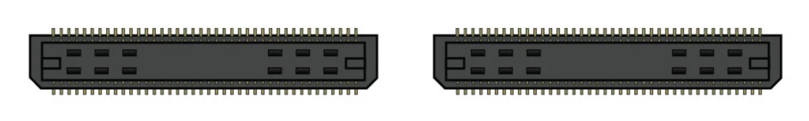

.. _orderingparts:
.. role:: raw-html-m2r(raw)
   :format: html

***********************************
Ordering parts
***********************************

Download the files
###################################

Clone the `acquisition-board <https://github.com/open-ephys/acquisition-board>`__ GitHub repository, or download it as a `zip file <https://github.com/open-ephys/acquisition-board/archive/master.zip>`__.

Acquire the raw materials and tools
###################################

Open up BOM.csv in Excel or a text editor (or `view it on Google Docs <https://docs.google.com/spreadsheet/ccc?key=0An1VoeoG8K6AdHhqNjhneGZWWkR5R2hZcDFOd243dHc#gid=0>`__). This is a list of all the parts that are necessary to populate the acquisition board PCB. Most of them can be ordered from DigiKey, but some are only available from other distributors. The quantities (column B) are for one acquisition board, so take that into account if you're trying to build multiple boards.

**Samtec** - For each board, you'll need two of Samtec part #BTE-040-01-F-D-A. These are the connectors that interface with the FPGA. They can be ordered directly from Samtec for around $4 each, or from Opal Kelly for $10/pair. These are referred to as BRD1 on BOM.csv, and as "JP2" and "JP3" on the silkscreen layer of the acquisition board PCB.

**Omnetics** - Each board requires 4 of Omnetics part #A79623-001 to interface with the headstages. These must be ordered directly from Omnetics. Not only are they expensive (~$30 each for an order of this size), but they have a 6-week lead time. Sometimes if you hassle them, they'll send them faster. It would be incredibly helpful if someone wanted to act as an Omnetics reseller for neuroscientists. If this is something you might have the resources to implement, definitely let us know! We would do it if we had the money.

**Adafruit** - Hat tip to Caleb Kemere for finding these awesome LEDs! The WS2812s contain red, green, and blue LEDs and integrated driver circuitry. They can all be driven by a single data line, using a special programming sequence. You can buy 10 of them from Adafruit for $4.50, but unfortunately they aren't shipped in their original packaging. This means they can be subjected to moisture damage when they're heated up during the soldering process. In our experience, about 1 out of 10 LEDs had to be replaced. If you have the budget for it, or you plan on building a bunch of boards, we'd recommend ordering a roll of 100 or more LEDs from a reseller on Alibaba.

**DigiKey** - if you're having the board assembled for you, the fabrication company can take care of the DigiKey order. You'll need to send them the parts from Adafruit, Samtec, and Omnetics, but they'll order everything else based on the Bill of Materials. If you're building it yourself, you'll have to go to the "Fast Add" page and enter the quantities and part numbers for each line item. The resistors and capacitors are cheap, so it's usually worth ordering 50 or 100 of each. For the more expensive parts, having 25% more than you actually need is always a good idea.

Here is a link to a fully filled-out digikey cart. It includes 5-10% extra of the very cheap (<$1) components, but otherwise no more than necessary for a single board.

**Hot air station** - This is necessary only if you're building the board yourself. If you don't have one already, the X-TRONIC Model #4040 is a great deal for only $140. We've used it to make multiple acquisition boards and it works superbly!

Order the PCB and Stencil
###################################

We recommend ordering your PCBs from Advanced Circuits, since that's what we're using, and we know they can handle our tolerances. The total cost will be about $260 for a single board, as long as you have an academic affiliation to qualify for a discount and a small run. Note that the board is just a bit too big to qualify for the $66 special on multi-layer boards that is prominently mentioned on Advanced Circuits' home page.

To place this order, you need to first upload the gerber.zip file from the github repository to www.freedfm.com, which is the automatic file checker used by Advanced Circuits. You will need to tell FreeDFM which file corresponds to each layer, and you must specify the inner layers 2 and 3 as "positive polarity". This is shown in the screenshot below.

Then enter the following specifications:

* Part Number: 1. This doesn't actually matter, but you can't leave it blank.
* Layer Count: 4
* X Dimension: 6.3
* Y Dimension: 6.415
* Silkscreen sides: Both sides
* Soldermask Color: Green (cheaper) or Black (looks nicer)
* Copper Weight Inner: 1oz
* (Not necessary with FreeDFM) Smallest Hole Size: 0.015
* (Not necessary with FreeDFM) Top SMD Pads: 1058
* (Not necessary with FreeDFM) Holes Per Board: 1370
* ITAR: No
* Quantities: Something like 1/2/5/10 will give you an idea of the relationship between price and order size.

Everything else you can leave as the default. The website will perform some automated checks on the files, which will take about 30 minutes. Then it will produce a quote matrix, in which the price is a function of the production time and the quantity you want. You can change the quantity to 1. The quote will be around $560, but if you contact them and mention your academic affiliation, they should offer you a 50% off coupon code.

In general, Advanced Circuits' prices are pretty competitive with other fab houses. The exception to this is Seeed Studio, which is incredibly cheap. A minimum order for 5 boards will set you back $139.90 (+$31.34 UPS shipping). The turnaround to your door is about 6 days from the time of order. They are not as well made as Advanced Circuits PCB's, but perfectly acceptable. When placing the order, use the following specifications:

* PCB layer: 4
* PCB thickness: 1.6mm
* PCB dimension: 20cm x 20cm
* PCB colour: green (black is + $20)
* Surface finish: HASL (ENIG finish is +$16)
* Panelised PCB's: no
* Remember to specify the inner copper layers as 'positive' after uploading the gerber files

If you're going to build the board yourself, you'll need to order a stencil and some solder paste. We recommend OSH Stencils, which are designed for small-run fabrications and are priced accordingly. You'll need to upload the same gerber.zip file that you used to print the PCB. Then identify the top solder paste file (*.tsp) as the top stencil and the board outline file (*.oln) as the board outline. Mark all other files, including all solder mask files, as unused. You don't need a bottom stencil because none of the components attach to the bottom of the board. The total cost should be about $21, with an option to buy a "jig" (which helps to position the stencil) for an additional $5. For the solder paste, do yourself a favor and buy SPE-0012 ZephPaste. It's by far the best solder paste we've used. Just remember to keep it refrigerated!

Case components
###################################

The shape of the case is specified by an STL (stereolithography) file called acquisition-board-case.stl  (github). You can use it to have a case manufactured through a variety of methods, such as cast urethane (we recommend American Precision Prototyping), CNC machining (FirstCut), or 3D printing (Shapeways). Shapeways requires a .dae file, which is also included in the repository.

To order the acrylic top, upload acquisition-board-top-text-ponoko_p1.eps to Ponoko, and select size P1 Opal Acrylic (3 mm / 0.118"). If you're producing multiple boards, you may want to use acquisition-board-top-text-ponoko_p3.eps instead, which has 8 tops tiled onto a single piece of acrylic.

You'll also need 4 screws (92855A310) and rubber feet (9540K11) from McMaster-Carr. Having some extra M3 (2 mm) hex keys (5984A42 from McMaster) will be useful. Depending on the method of manufacturing, you may have to drill out the four screw holes in the bottom of the case. You can use a #37 drill bit, or even better, use a fluted tapping tool (M3 size, 26355A41 should work well - in a low speed electric drill) to prepare the holes.
