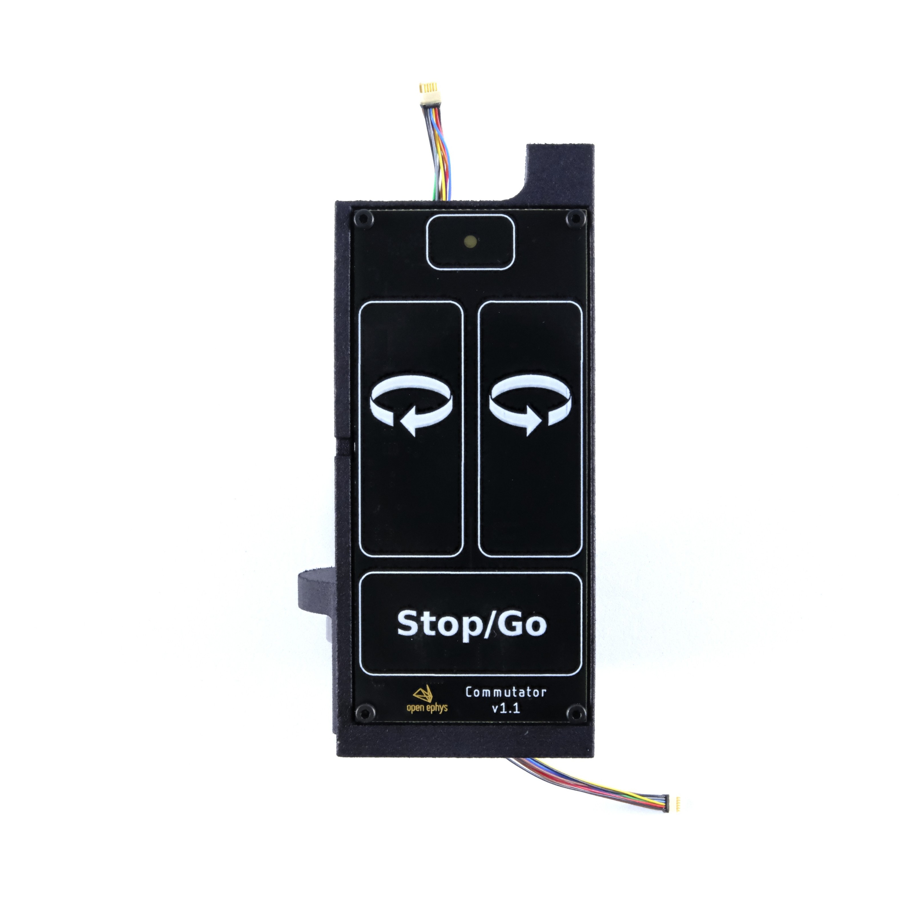

.. _commutators:
.. role:: raw-html-m2r(raw)
   :format: html

***********************************
Commutators
***********************************

Commutators make a rotary electrical connection which maintains power and data transmission between a moving and a stationary cable. They are used to prevent tether twisting during freely moving recordings of animals, since the animals move while wearing a headstage which remains connected to a stationary acquisition system.

Commutators are placed overhead the behavioral arena, and two SPI tethers are required for the connection: one from the headstage to the commutator, and one from the commutator to the Acquisition Board.

Commutators compatible with the Acquisition Board require a 12-pin connection for the SPI tethers. Most will have PZN-12 polarized nano connector which mate directly with the connector on the SPI cables, and to interface with bare wires you can use an `RHD SPI cable adapter board <https://intantech.com/RHD_SPI_cables.html?tabSelect=RHDSPIadapter&yPos=48.88888931274414>`_.

Our torque-free SPI Commutator
###################################

Our torque-free SPI Commutator is a motorized commutator that works by correcting tether position using moment-to-moment information about the animal’s rotational state, instead of relying on tether torque measurement, which is used in conventional active commutators.

   Open Ephys Torque-free Commutator - SPI

The inertial-measurement units (IMUs) embedded on :ref:`our 3D capable headstages <3dcap>` in combination with the 3rd Gen Acquisition Board provide real-time measurements of animal orientation which drive the commutator to compensate automatically. This precludes the need for the animal to tug on the tether to engage the commutator and thus promotes natural animal behavior.

This commutator can also receive commands from other real-time measurements of animal orientation such as video-based pose-estimation methods (e.g. DeepLabCut or SLEAP), which would the way to use it to commutate headstages without 3D capabilities. Please refer to the `Commutators documentation site <https://open-ephys.github.io/commutator-docs/>`_ for further information.