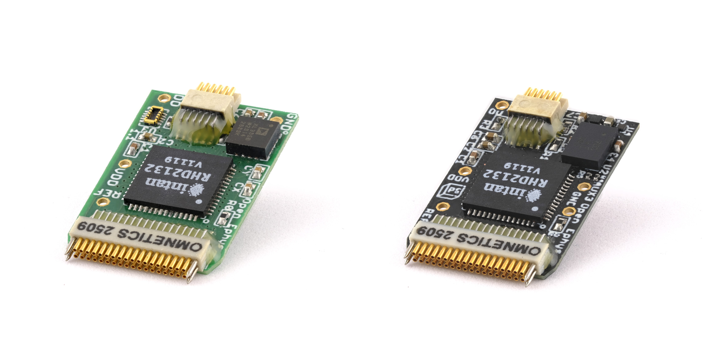

.. _headstages:
.. role:: raw-html-m2r(raw)
   :format: html

***********************************
Headstages
***********************************
Biologically generated signals typically have a very small amplitude, and are therefore easily lost due to electrical noise interference or the impedance of cables. The 'headstage' is the name of the hardware located closest to the subject of the experiment, which filters, amplifies, and digitizes the signal that was detected by the electrodes. This turns the tiny analog signal into a higher-amplitude digital signal that can travel over longer wires without suffering data loss. The FPGA in the Acquisition Board drives the headstages, sending an SPI command to all attached headstages in order to sample the data they are receiving.

The Acquisition Board works with industry standard Intan RHD recording chips to interface with passive electrodes such as silicon probes, twisted wires and other microelectrode arrays.

Headstages compatible with the Acquisition Board need to have:

- `Intan RHD2000-series bioamplifier chips <https://intantech.com/files/Intan_RHD2000_series_datasheet.pdf>`_ (up to two 64ch chips per headstage)
- the Serial Peripheral Interface (SPI) protocol implemented in a 12-wire SPI connection as per the `Intan specification <https://intantech.com/files/Intan_RHD2000_SPI_cable.pdf>`_.

In addition to these requirements, headstages vary and can be characterized by a number of features.

- Type of electrode inputs on the RHD2000-series chip (unipolar or bipolar)
- Number of neuronal recording channels (16, 32, 64, 128...)
- Electrode connector (Omnetics, Hirose, Molex, etc)
- Additional sensors (3-axis accelerometer for motion detection, 9-axis inertial measurement unit for 3D capabilities)
- Shape (standard, low-profile, compact, etc)

The relative importance of each will depend on the equipment you have and the experiments you want to perform.
For example:

- the number of channels you'd like to record from and the type of probe or electrode array you intend to use will define the channel count
- the connector on the probe or electrode interface board (EIB) needs to be compatible with that on the headstage, or use a corresponding adapter
- to reduce torque for freely-behaving tetrode recordings, a low-profile headstage is more suitable than a standard upright one
- if you intend to acquire local field potentials and single units using a common reference, you'd use a unipolar headstage, but if you have impedance matched pairs of electrodes for EMG or EEG acquisition, you'd use a headstage with bipolar inputs.
- if you want to record absolute head orientation (pitch, yaw, roll) or drive our torque-free commutator, you need 3D capabilities

Our headstages
###################################

We produce a variety of headstages compatible with the Acquisition Board: 32 and 64 ch, unipolar and bipolar, standard and low-profile, with accelerometer or 3D capabilities. Check out the range of headstages available `on our store  <https://open-ephys.org/acquisition-system>`_.

Our range includes the Low-profile SPI Headstages 64ch that sit flat on the head for reduced torque, the standard profile SPI headstages 32 ch unipolar for Omnetics-based silicon probes, and the standard profile SPI headstages 16 ch bipolar optimal for recordings with electrodes of similar impedance, such as those used for EMG. We have two variants of each of these headstages: you can choose between a 3D capable variant for recording absolute head orientation and driving our torque-free SPI commutator or a variant with just a 3-axis accelerometer that allows basic motion detection.

Low-profile vs standard headstages
+++++++++++++++++++++++++++++++++++++++++++++++++

The low-profile SPI Headstage was designed by Open Ephys specifically to reduce torque in freely-behaving experiments using the `ShuttleDrive micro-wire implant <https://open-ephys.org/shuttledrive>`_.

   Low-profile SPI Headstage 64ch (Hirose) with 3D

The flat, round design means that the center of mass of the headstage is closer to the head of the animal. This cuts torque in half, reducing the impact on animal. Mice with this headstage can easily lower their heads and perform most licking/nosepoke paradigms. (Imagine wearing a heavy tall hat, and how that would influence your balance.)

.. figure:: ../_static/images/usermanual/headstages/image-20201209-170837.png
   :width: 50%
   :align: center

   Left: Standard 64ch headstage with higher weight and torque; Right: Low-profile 64ch headstage

Besides this main advantage, this headstage:

- uses a Hirose connector compatible with our ShuttleDrive 64-ch Hirose EIB, rather than an Omnetics connector, which greatly reduces cost
- weighs 0.92 g, 0.46 g lighter than 64 ch standard profile Omnetics-based headstages
- has 2 built-in LEDs for tracking purposes
- comes in both the accelerometer or 3D capabilities variants

Additional headstage sensors
++++++++++++++++++++++++++++++++

In addition to the main functionality of recording neuronal signals using the bioamplifier chip, headstages can have additional sensors.

Our headstages can have either a 3-axis accelerometer or 9-axis inertial measurement unit (IMU) to sense absolute head orientation.

   Left: Open Ephys SPI 32ch headstage with accelerometer; Right: Open Ephys SPI 32ch headstage with 3D capabilities

Accelerometer
----------------

A 3-axis accelerometer on the headstage can be used to synchronize electrophysiological data with headstage movement. These signals can be
calibrated to yield precise acceleration as per `this application note  <https://intantech.com/files/Intan_RHD2000_accelerometer_calibration.pdf>`_.

.. _3dcap:

3D capabilites
----------------

Our 3D capable headstages are unique in that they can accurately monitor absolute head orientation thanks to an embedded 9-axis inertial measurement unit (IMU). This technology senses rotational movements (pitch, yaw, and roll) which can be used to correlate neural activity with behavioral states.

Additionally, the information from this sensor can drive our torque-free SPI commutator for twist-free naturalistic recordings.

.. important:: 3D capabilities require an Open Ephys Acquisition Board (3rd Generation) to work.

.. important:: 3D capabilities cannot be used when operating the headstage combined with a dual headstage adapter. 

Channel Mapping
++++++++++++++++++++++++++++++++

Headstage manufacturers provide a diagram to indicate which contact on the headstage electrode connector is wired to which recording channel in the Intan chip.

For our headstages, use `this sheet <https://docs.google.com/spreadsheets/d/1WYDymxNqGRtFPxn69H9JzeMgePpXcFSPHiWJYBE0lu4/edit#gid=0>`__ to map each electrode recording channel on your probe or electrode interface board to the data acquisition software.

Compatibility with other acquisition systems
##############################################

Open Ephys SPI headstages are compatible with many modern digital systems based on the same technology, such as the Intan RHD USB Interface Board and the Intan RHD recording controller.

Likewise, SPI headstages with an RHD chip from other vendors such as those from `Intan's RHD range <https://intantech.com/RHD_headstages.html>`_ are compatible with the Open Ephys Acquisition Board.