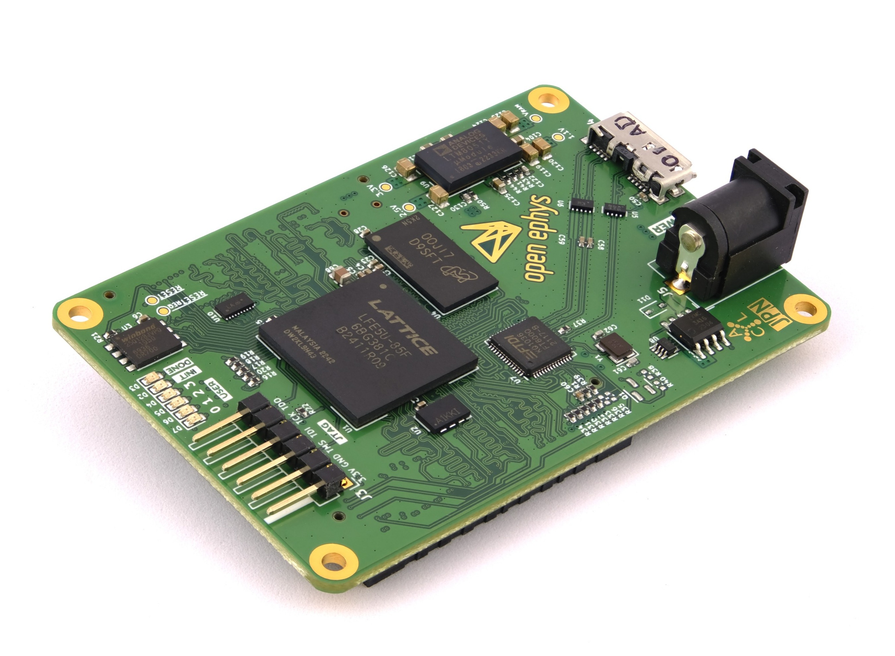
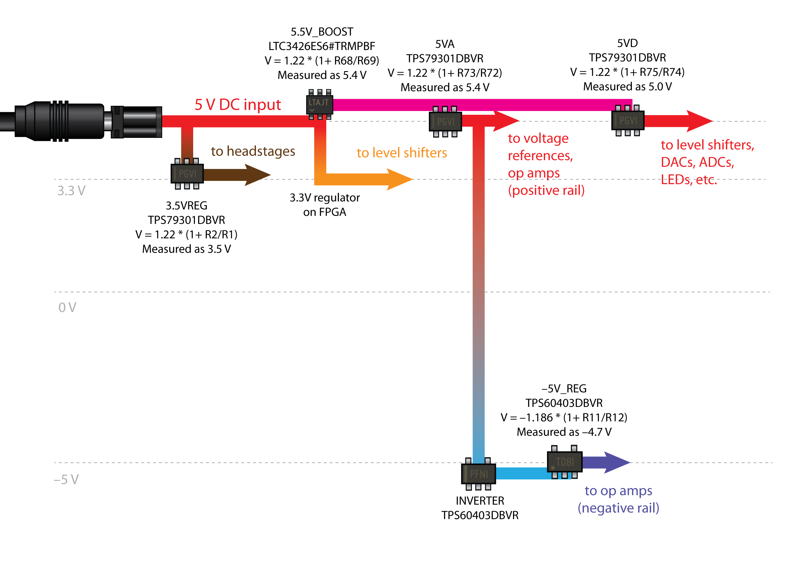

.. _howitworks:
.. role:: raw-html-m2r(raw)
   :format: html

***********************************
Acquisition Board
***********************************

This page provides some additional details about how the Acquisition Board works "under the hood", rather than how the end user should interact with it. We recommend reading this page carefully before using the Acquisition Board, and especially if you're going to build it. When something goes wrong, or if your data look suspicious, knowing the basics of how the hardware works will make it easier to troubleshoot. And the more people who have a thorough understanding of the Open Ephys ecosystem, the easier it will be to support new users.

The following material assumes a basic understanding of electronic circuits. If you don't have any hands-on experience working with electronics, you can follow the `Open Ephys course on extracellular electrophysiology acquisition <https://open-ephys.github.io/ephys-course>`_. It would also be helpful to read through the documentation available on the Intan website, as almost everything related to the `RHD2000 chips <https://intantech.com/products_RHD2000.html>`_ is relevant to the data you will collect with the Acquisition Board.

the documentation available on the 

.. image:: ../_static/images/usermanual/ac_board_pcb.png

Neural data acquisition
###################################

The filtering, amplification, and digitization of neural data is handled by the Intan RHD chips on the headstages. Each chip contains 32 or 64 20x gain amplifiers, as well as configurable bandpass filters. During the amplification step, the voltage from each electrode is referenced to either a common REF input (RHD2132 and RHD2164 chips), or to a separate reference/negative input for each channel (RHD2216 chips). The voltage is then multiplexed in time at a speed of up to 30 kHz per channel, and digitized by an on-chip 16-bit analog-to-digital converter (ADC). From this point on, electrical noise will not degrade the signal, as long as the integrity of the digital signals is maintained.

The data is transmitted from each Intan chip to the FPGA on the Acquisition Board via a serial protocol that also handles configuration of the chip (mainly setting of the bandpass filters) and transmits some extra data such as temperature, supply voltage at the headstage, and in the case of many headstages, accelerometer data. The headstages are connected using standardized SPI cables using 12-pin Omnetics connectors (part #PZN-12).

FPGA module
###################################

The brain of the acquisition board is the FPGA, or "Field-Programmable Gate Array". This part makes up about half the cost of an acquisition board, so it better do something crucial. From a high-level perspective, the FPGA combines data from everything that's connected to the acquisition board, attaches a common timestamp, and sends it to the computer via USB. It effectively acts as a "dumb pipe," shuttling data between peripheral devices (such as headstages and I/O boards) and the computer, where more sophisticated processing can take place. An FPGA is sort of a cross between a microcontroller (like ones on Arduino boards) and an integrated circuit (IC) composed of interconnected transistors. As opposed to an IC, an FPGA can be reconfigured on the fly. The instructions, called "gateware", that are uploaded to the FPGA all run in parallel, rather than being called consecutively inside a loop like in a microcontroller. That means the FPGA can be really fast and its timing can be very precise. This is essential for collecting data at 30 kHz per channel across each of an Intan chip's 32 or 64 channels. 

.. figure:: /_static/images/usermanual/xem6310.jpg
   :width: 70%
   :align: center

   The Opal Kelly XEM6310 used in earlier generations of the Open Ephys Acquisition Board. 

For the original acquisition board, we chose to use the Opal Kelly XEM6310 USB 3.0 FPGA development module with the Xilinx Spartan-6 FPGA because of the terrific programming interface provided by Opal Kelly. After Opal Kelly suddenly end-of-lifed the XEM6310 at the end of 2021, we switched to using a custom FPGA module designed and manufactured by the Open Ephys team. 

   The Open Ephys FT600 USB board FPGA module developed by the Open Ephys team. 

Our Open Ephys FPGA module uses the same footprint as the previous Opal Kelly one so it can be replaced directly on the existing acquisition boards, although it uses a different FPGA, a Lattice EPC5. Its `design is open source <https://github.com/open-ephys/ECP5U85-BSE-USB>`_ and PC communication is compliant with the our `ONI standard <https://open-ephys.github.io/ONI/>`_ for common interfaces in neuro tools, which is the same standard that powers our more advanced system `ONIX <http://open-ephys.github.io/onix-docs/>`_. The Open Ephys FPGA modules are used for all Acquisition Boards Gen 2 and above.

The FPGA itself is programmed in a language called Verilog. Verilog is a type of "hardware description language," because it specifies the actions of registers and logic gates, rather than functions and variables. Verilog is compiled to a "bitfile," which must be uploaded to the FPGA each time it's used. Compiling the bitfile can take several minutes, but uploading it occurs almost instantaneously. In the original Opal Kelly module, the bitfile is uploaded by the OE GUI each time the board is recognized, while in the new Open Ephys FPGA module, the bitfile resides permanently on the board. The gateware on Open Ephys FPGA modules can be updated by following :doc:`these instructions </User-Manual/Gateware-Update>`. An onboard bitfile makes it easier to use the acquisition board across different software like Bonsai as it avoids bitfile path issues. The Verilog code that runs on the acquisition board FPGA is our custom version of the "Rhythm" interface developed by Intan. We had to change a few things in order to communicate with our analog-to-digital converters (we're using Texas Instruments ADCs, rather than Analog Devices) and control the 8 LEDs on the board. If you're interested, you can take a look at the `source code <https://github.com/open-ephys/rhythm>`_ (but this is not recommended unless you have some prior Verilog experience).

Analog and Digital I/O
###################################

See :ref:`peripheraldevices`.

Power Supply
###################################

The acquisition board runs on a 5V DC power supply. DO NOT use any other type of power supply, as it could permanently damage the board.

Since consumer-grade wall socket power supplies tend to be rather noisy, we have added our own 5V regulators on the board. There are a few other regulators for different functions, such as powering the headstages and creating a –5V rail for the op amps. 

Below is a schematic of all the voltage levels on the board. The main ones have test holes labeled on the bottom of the board, so you can check the voltage without opening up the case.

Other Features
###################################

*LEDs:* The eight WS2812B :ref:`statusleds` can be controlled via a single digital line, and don't require any external parts except for a 0.1 µF bypass capacitor.

*BNC clock output:* The connector is a great way to ground your board if you're running it off battery power! You would do this by connecting the outer shield of this connector (NOT the center pin) to an appropriate ground – a large metal rack, a piece of copper sunk deep into the wall, or even the ground plug of a 3-prong outlet.

*I2C bus:* Each of the four HDMI ports includes 2 channels that are connected to an I2C bus. This will provide a convenient way to expand the functionality of the acquisition board through custom I/O boards. However, the I2C functionality hasn't yet been added to the FPGA firmware.

.. _newfpga_licenses:

External Licenses
---------------------------
The Open Ephys FPGA board makes use of `LiteDRAM <https://github.com/enjoy-digital/litedram>`_ as a memory controller.

   *Unless otherwise noted, LiteDRAM is Copyright 2012-2022 / EnjoyDigital*
   *Initial development is based on MiSoC's LASMICON / Copyright 2007-2016 / M-Labs*

   *Redistribution and use in source and binary forms, with or without modification,*
   *are permitted provided that the following conditions are met:*

   *1. Redistributions of source code must retain the above copyright notice, this*
   *list of conditions and the following disclaimer.*

   *2. Redistributions in binary form must reproduce the above copyright notice,*
   *this list of conditions and the following disclaimer in the documentation*
   *and/or other materials provided with the distribution.*

   *THIS SOFTWARE IS PROVIDED BY THE COPYRIGHT HOLDERS AND CONTRIBUTORS "AS IS" AND ANY EXPRESS OR IMPLIED WARRANTIES, INCLUDING, BUT NOT LIMITED TO, THE IMPLIED WARRANTIES OF MERCHANTABILITY AND FITNESS FOR A PARTICULAR PURPOSE ARE DISCLAIMED. IN NO EVENT SHALL THE COPYRIGHT OWNER OR CONTRIBUTORS BE LIABLE FOR ANY DIRECT, INDIRECT, INCIDENTAL, SPECIAL, EXEMPLARY, OR CONSEQUENTIAL DAMAGES (INCLUDING, BUT NOT LIMITED TO, PROCUREMENT OF SUBSTITUTE GOODS OR SERVICES; LOSS OF USE, DATA, OR PROFITS; OR BUSINESS INTERRUPTION) HOWEVER CAUSED AND ON ANY THEORY OF LIABILITY, WHETHER IN CONTRACT, STRICT LIABILITY, OR TORT (INCLUDING NEGLIGENCE OR OTHERWISE) ARISING IN ANY WAY OUT OF THE USE OF THIS SOFTWARE, EVEN IF ADVISED OF THE POSSIBILITY OF SUCH DAMAGE.*
   *Other authors retain ownership of their contributions. If a submission can reasonably be considered independently copyrightable, it's yours and we encourage you to claim it with appropriate copyright notices. This submission then falls under the "otherwise noted" category. All submissions are strongly encouraged to use the two-clause BSD license reproduced above.*
