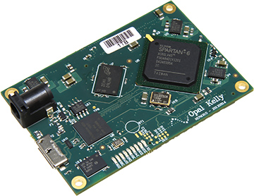

.. _howitworks:
.. role:: raw-html-m2r(raw)
   :format: html

***********************************
How it works
***********************************

This page provides some additional details about how the Acquisition Board works "under the hood", rather than how the end user should interact with it. We recommend reading this page carefully before using the Acquisition Board, and especially if you're going to build it. When something goes wrong, or if your data look suspicious, knowing the basics of how the hardware works will make it easier to troubleshoot. And the more people who have a thorough understanding of the Open Ephys ecosystem, the easier it will be to support new users.

The following material assumes a basic understanding of electronic circuits. If you don't have any hands-on experience working with electronics, you can follow the Open Ephys course on extracellular electrophysiology `here <https://ahleighton.github.io/OE-ephys-course/>`_. It would also be helpful to read through the documentation available on the Intan website, as almost everything related to the RHD2000 chips is relevant to the data you will collect with the Acquisition Board.

.. image:: ../_static/images/usermanual/ac_board_pcb.png

Neural data acquisition
###################################

The filtering, amplification, and digitization of neural data is handled by Intan's RHD chips. Each chip contains 32 or 64 20x gain amplifiers, as well as configurable bandpass filters. During the amplification step, the voltage from each electrode is referenced to either a common REF input (RHD2132 and RHD2164 chips), or to a separate reference/negative input for each channel (RHD2216 chips). The voltage is then multiplexed in time at a speed of up to 30 kHz per channel, and digitized by an on-chip 16-bit analog-to-digital converter (ADC). From this point on, electrical noise will not degrade the signal, as long as the integrity of the digital signals is maintained.

The data is transmitted from each Intan chip to the FPGA on the Acquisition Board via a serial protocol that also handles configuration of the chip (mainly setting of the bandpass filters) and transmits some extra data such as temperature, supply voltage at the headstage, and in the case of many headstages, accelerometer data. The headstages are connected using standardized SPI cables using 12-pin Omnetics connectors (part #PZN-12).

FPGA
###################################

The heart of the acquisition board is the FPGA, or "Field-Programmable Gate Array." This part makes up about half the cost of an acquisition board, so it better do something crucial. From a high-level perspective, the FPGA combines data from everything that's connected to the acquisition board, attaches a common timestamp, and sends it to the computer via USB. It effectively acts as a "dumb pipe," shuttling data between peripheral devices (such as headstages and I/O boards) and the computer, where more sophisticated processing can take place. However, this doesn't even come close to taking advantage of all of the FPGA's capabilities. An FPGA is sort of a cross between a microcontroller (like an Arduino) and a circuit composed of interconnected transistors. It can be reconfigured on the fly, but the modules that are uploaded all run in parallel, rather than being called consecutively inside a loop. That means the FPGA can be really fast and its timing can be very precise. This is essential for collecting data at 30 kHz per channel across each of an Intan chip's 32 or 64 channels.

For the original acquisition board, we chose to use the Opal Kelly XEM6310 USB 3.0 board because of the terrific programming interface provided by Opal Kelly. If we just soldered the bare FPGA (Xilinx Spartan-6) to the acquisition board, it would have driven down costs significantly, but would have required some serious programming chops to get it to play nicely with the computer. Since we're already at such a low price point, our most precious resource is time, rather than money.

After Opal Kelly deprecated the XEM6310, we switched to using a custom FPGA board designed and manufactured by the Open Ephys team. The Open Ephys FPGA boards are used for all acquisition boards sold since December 2022.

The FPGA itself is programmed in a language called Verilog. Verilog is a type of "hardware description language," because it specifies the actions of registers and logic gates, rather than functions and variables. Verilog is compiled to a "bitfile," which must be uploaded to the FPGA each time it's used. Compiling the bitfile can take several minutes, but uploading it occurs almost instantaneously. The Verilog code that runs on the acquisition board FPGA is our custom version of the "Rhythm" interface developed by Intan. We had to change a few things in order to communicate with our analog-to-digital converters (we're using Texas Instruments ADCs, rather than Analog Devices) and control the 8 LEDs on the board. If you're interested, you can take a look at the `source code <https://github.com/open-ephys/rhythm>`_ (but this is not recommended unless you have some prior Verilog experience).

Analog and Digital I/O
###################################

See :ref:`peripheraldevices`.

Power Supply
###################################

The acquisition board runs on a 5V DC power supply. DO NOT use any other type of power supply, as it could permanently damage the board.

Since consumer-grade wall socket power supplies tend to be rather noisy, we have added our own 5V regulators on the board. There are a few other regulators for different functions, such as powering the headstages and creating a –5V rail for the op amps. 

Below is a schematic of all the voltage levels on the board. The main ones have test holes labeled on the bottom of the board, so you can check the voltage without opening up the case.

.. image:: ../_static/images/usermanual/powersupply.png
  :alt: Details of the internal voltages

Other Features
###################################

*LEDs:* The eight WS2812B :ref:`statusleds` can be controlled via a single digital line, and don't require any external parts except for a 0.1 µF bypass capacitor.

*BNC clock output:* The connector is a great way to ground your board if you're running it off battery power! You would do this by connecting the outer shield of this connector (NOT the center pin) to an appropriate ground – a large metal rack, a piece of copper sunk deep into the wall, or even the ground plug of a 3-prong outlet.

*I2C bus:* Each of the four HDMI ports includes 2 channels that are connected to an I2C bus. This will provide a convenient way to expand the functionality of the acquisition board through custom I/O boards. However, the I2C functionality hasn't yet been added to the FPGA firmware.
