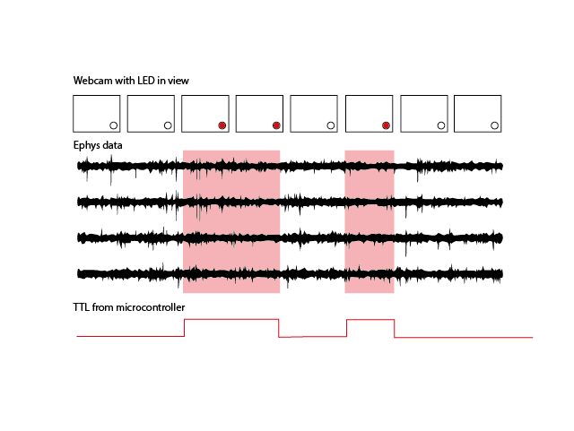
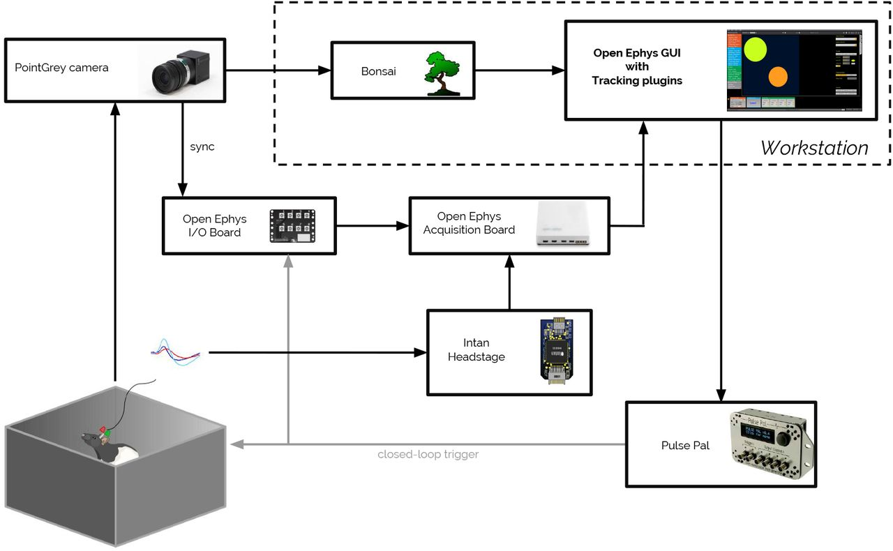

.. _ephyswithbehaviouralcam:
.. role:: raw-html-m2r(raw)
   :format: html

**********************************************************************
Synchronizing with a behavioural camera
**********************************************************************

Using a webcam
###################################
With 'webcam', we mean a camera that can not send a TTL pulse whenever it acquires a frame. This can be problematic, because you need to know which camera frame corresponds to which electrophysiological samples.  You can still use these cameras for behavioural tracking.

You can do this using a microcontroller such as an Arduino or a Teensy, running a program that periodically sends a 'high' digital pulse. Route this pulse to an LED, so that it lights up when the signal is 'high', and to the digital input to the Open Ephys board, so that the acquisition hardware and software knows when the LED was on. Include the LED in the field of view of the camera (where the animal is not influenced by it) so that the camera recordings, visually, when the LED was on.
The most appropriate pattern for your LED depends on your experiment, but this way you have an anchoring signal to link your behaviour and ephys data.

Using a behavioural camera with GPIO/ TTL output
######################################################################

1) You can acquire the camera data in its own software or Bonsai, and send a TTL to the digital input of the Acquisition Board, so that each frame of the camera is marked in time on the electrophysiology acquisition. Make sure to have your ephys recording before you start the camera, so that you know which is the first frame.

1) Bonsai: Bonsai can handle inputs from many types of camera. You can record

2) Open Ephys GUI Plugin

There is a specific plugin for the Open Ephys GUI that uses the tracking capability of Bonsai and integrates this in the Open Ephys GUI for visualisation. Read the paper `here. <https://iopscience.iop.org/article/10.1088/1741-2552/aacf45#jneaacf45s2>`_

