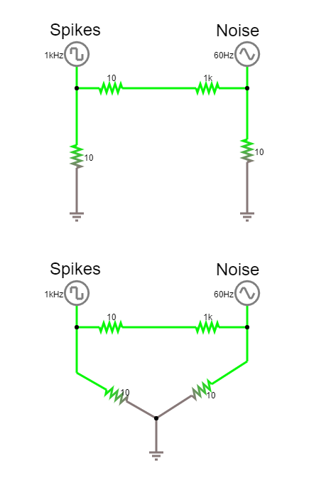

.. _troubleshootingnoise:
.. role:: raw-html-m2r(raw)
   :format: html

***********************************
Troubleshooting Noise
***********************************

The recordings with our acquisition system will contain three parts:
1) The biologically generated signal we are interested in
2) Biologically generated signals we are not interested in, for instance from other regions or other activity types.
3) Electrical signals from other sources, e.g. 'noise'. It is good to realise that we live in an electrically noisy world.

We can use filtering to extract the frequencies that are relevant to our experiment. For instance, if we want to record spikes, we will filter out slower frequencies that are more likely to be generated by synaptic inputs. Though we can get rid of some noise through filtering, noise with large amplitude or at frequencies similar to our desired signals can be a real problem.

GND vs. REF on the Headstage
###################################
The ground (GND) and reference (REF) connectors on the headstage aren't the same thing, though most EIBs and adapters that we've been using do tie them together. The reference is the signal that will be subtracted from your measurement electrodes to produce the output of the headstage. The ground connector is often used with a ground pin or screw to bring the animal to the same level as the acquisition system ground, thereby getting rid of any electric potential difference offsets that may cause the headstage amplifier to saturate.
Often, GND and REF are connected, so that fluctuations in the signal detected by the ground pin are used as a reference signal. Alternatively, the two can be separate, which is typical for EEG or EMG recordings. It's important to understand the difference and decide whether having a connected ground and reference is the correct choice for your experiment.
Click `here <https://ahleighton.github.io/OE-ephys-course/EEA/theoryday3.html#why-do-we-need-a-ground-electrode>`_ to learn more.
.. ref to skillhub

Extra shielding
###################################
A simple and fast solution to some otherwise unsolvable noise might be to add even a partial Faraday cage to your recording sites. This is true even with implants that already have a complete shielding - as long as part of your animal is not shielded, it can still pick up noise.

Line Noise caused by USB ground
###################################
Sometimes, the USB cable that connects the acquisition board to the PC (which is grounded to the building ground via the power supply) isn't good enough -  grounding the external shield of the USB cable that connects the FPGA to the computer can help.

Don't use ungrounded laptops with no extra ground
######################################################################
If you're using the acquisition board with a laptop that's running off battery power, you will have a "floating" ground, as no part of the circuit is connected to an earth. This can cause your signals to look extremely noisy. To fix the issue, connect the ground of the acquisition board to whatever ground you're using for your experimental setup (perhaps a wall socket or a Faraday cage). You can either do this via the BNC connector (alligator clips work well for this), or by attaching a wire to one of the two dedicated screw terminals on the side of the board. The screw terminals are preferred because someday we may do something with the BNC. If you use the BNC, ground the shell of it to the wall, not the center pin. Connecting the center pin of the BNC to ground will short your board and may fry the FPGA.

Beware of bad power supplies
######################################################################
Sometimes, aftermarket power supplies, mostly for laptops, but also for LED lights, or any other power brick, can cause a lot of line noise - try individually turning off equipment to isolate the offending one. If 60 Hz is a president issue, it is worth trying powering the acquisition system from a high quality bench DC supply (5V) - this can significantly reduce noise in some cases.

Line noise caused by different power circuits
######################################################################
Make sure that all equipment, including the recording computer, is plugged into the same circuit and grounded to the same ground. This is especially crucial in buildings with separate building and earth grounds.
Be careful when bridging two ground circuits - sometimes they can carry a large potential difference.

Avoiding ground loops
###################################
Normally, we 'ground' equipment by attaching a single cable from the tool or shield to ground, often a conductive ground bus. This creates one low-resistance path, allowing any current to flow to ground and maintaining the grounded equipment at the same electric potential as the ground point.
'Ground loops' happen when we create a closed loop involving the ground.

In this simulator, (click on image to open) we have two sources, a square-wave at 1000 Hz and a sinewave at 60 Hz. Even when they are separately connected to ground, they are connected through the fact that there is only one ground 'point'; the upper and lower circuits are equivalent. If we connect the circuits, a loop is formed and their signals can interfere with each other. Even if these signals were not running, the physical loop of wire connecting them via ground can pick up magnetic fields (usually at utility frequency, 50 or 60Hz) and induce a current.

Use a central grounding point to prevent this. Only connect each piece of equipment to this once, and do not interconnect equipment when avoidable.

Antennae
###################################
Conductive, ungrounded parts of your setup can act as antennae when electromagnetic waves in the environment induce electron movement in that component.

..  add info here
