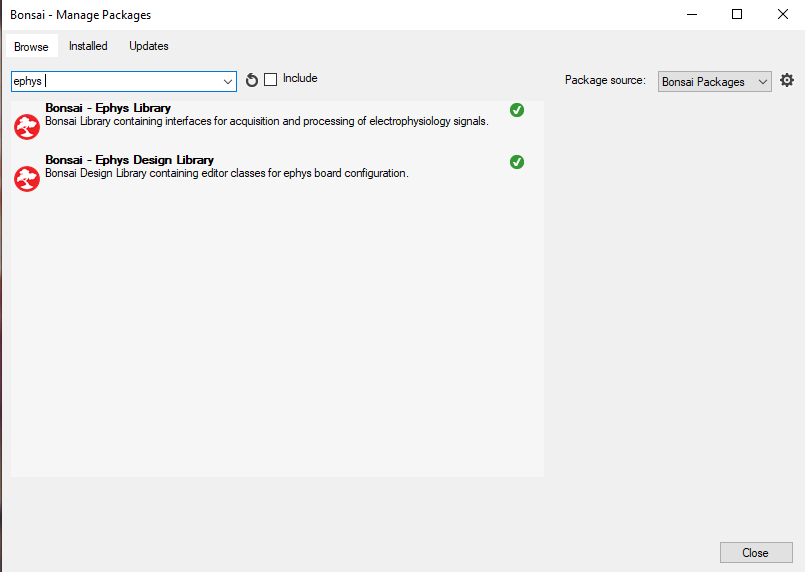
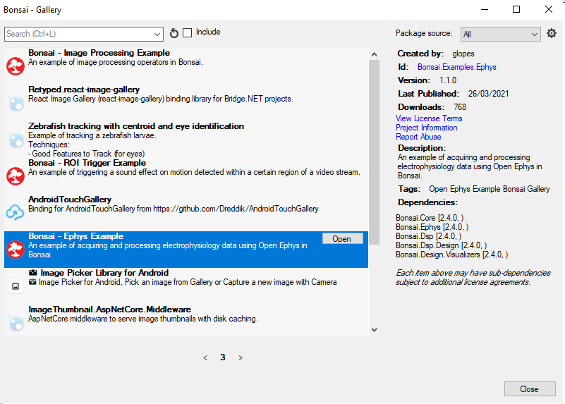
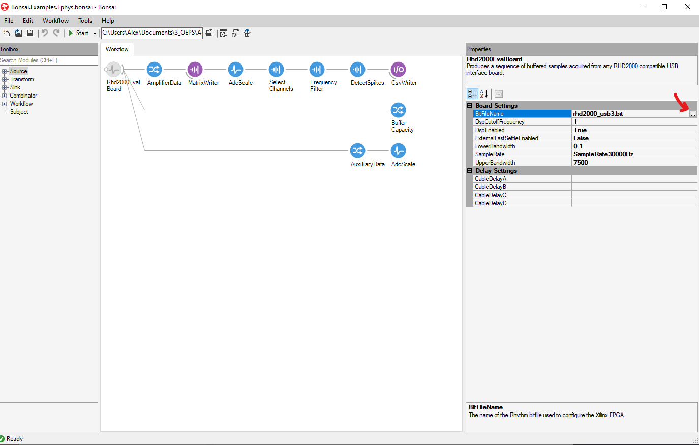
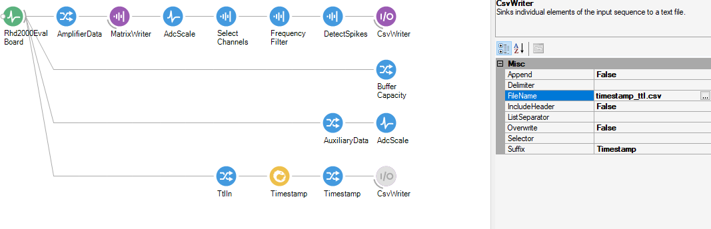

.. _bonsaiacq:
.. role:: raw-html-m2r(raw)
   :format: html

.. WORK IN PROGRESS

***********************************
Using Bonsai with the OE Board
***********************************

1. Install Bonsai from `here <https://bonsai-rx.org/>`_.
2. Click on:   Tools/ Manage Packages/

  In the package manager, search for 'Ephys'.

  Install the Ephys and Ephys Design Library.

3. The easiest place to start is with the example workflow for ephys.

4. Replace the bitfile

Click on the 'Rhd200EvalBoard' node to select it. On the right hand side, you will see a column where you can configure the properties of that node.
Click on the '...' to replace the default rhd2000_usb3.bit file with the rhd2000_usb3.bit file that is present in the installation of the Open Ephys GUI (if you have installed the GUI from here, you should find it in the installation folder).

5. Stream data

Make sure your Open Ephys Acquisition Board and a headstage are connected. You can use the headstage without an animal to perform test recordings, just using the noise that the headstage will pick up. Click 'Start' to run the workflow. Double-click on each node (circle) to open the visualiser at that point in the workflow, so that you can see what each step is doing.

6. Customize Workflow

The example selects only channel 1 and 2 using the 'Select Channel' node. Add all the channels you are interested in and run the workflow again. Use Page Up and Page Down to scroll through the pages of the visualiser.

Make sure you also check and if necessary adjust the settings for the frequency filter and spike detector.

You can extract more types of data from the board by right-clicking on the 'Rhd200EvalBoard' node. You can choose to visualise incoming TTL inputs, the auxiliary data from the headstage etc.

7. Check that your data is being saved

In Bonsai, data will only be saved if there is a purple 'sink' node at the end of the workflow. In the example, the ephys channel data is being saved in a .bin file that you can open in, for instance, Python or MATLAB. The extracted spikes are saved as a .csv that you can open in e.g. excel.

If you want to record incoming TTL timestamps you can add a branch as follows:

Before recording a real experiment, always do a trial recording to make sure your data is being saved, and that when you open it, it contains the expected number of channels etc. You can do this without an animal, just using noise recorded from the headstage.
