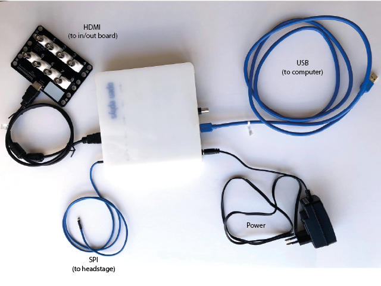
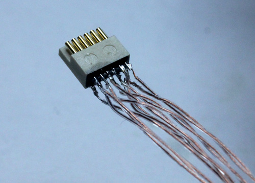

.. _cables:
.. role:: raw-html-m2r(raw)
   :format: html

***********************************
Cables
***********************************

To start using the Acquisition Board, you'll need the following cables:

:ref:`1_powercable`

:ref:`2headstage`

:ref:`3usb`

:ref:`iohdmi`

:ref:`5comm`

.. _1_powercable:

1. Power cable
###################################
If you buy the Acquisition Board from the `Open Ephys store <https://open-ephys.org/store>_` it ships with a wall adapter (to 5V) power supply that you can safely use with the board. Though the most recent versions have over-voltage protection, this isn't limitless so be careful to use the correct adapter when powering the board.

.. _2headstage:

2. Headstage to Acquisition Board cable
######################################################################
For recordings in freely behaving mice, it is important to minimize the weight and torque applied by the cables. This is especially important for experiments that require natural behavior and becomes a real issue for channel counts over 32 where even light wire tethers become bulky.

The standardized interface cable for Intan RHD chips we use is ideal for this application. Thanks to the `digital LVDS signal <https://en.wikipedia.org/wiki/Low-voltage_differential_signaling>`__, only 12 conductors are needed for transmitting up to 64 channels of neural data. Cables that conform to this standard can be purchased from the Intan website in 3- or 6-foot lengths. The cables for the acquisition board must conform to the SPI standard specified by Intan: http://www.intantech.com/files/Intan_RHD2000_SPI_cable.pdf

The current standard cable contains 2 MISO (headstage->computer) data lines, so it's possible to connect 2 headstages to one input on the acquisition board via one cable by using a `Y-adapter <https://intantech.com/RHD_SPI_cables.html?tabSelect=RHDdual&yPos=0>`_. For connectors we're using 12-pin Omnetics PZN-12 polarized nano connectors.

Intan cables
***********************************

`Details are available on the Intan website <https://intantech.com/RHD_SPI_cables.html?tabSelect=RHDSPIcables&yPos=100>`_. Intan cables are available as standard or ultra-thin, and the choice will depend on how much cable mass (and subsequent weight and torque) will influence your experiments, as well as how long you need your cable to be.

Dual-headstage adapter
***********************************

The `dual-headstage adapter <https://intantech.com/RHD_SPI_cables.html?tabSelect=RHDdual&yPos=100>`_ takes advantage of the 2 headstage-computer data lines in the SPI cable and exposes each line to a separate Omnetics connector, so that you can run two headstages off one cable. If you plan to use this adapter with daisy-chained cables resulting in a cable longer than 1.8 meters, be sure to `read the documentation <https://intantech.com/files/Intan_RHD2000_dual_headstage_adapter.pdf>`_ to make the necessary adjustments to the resistors on the adapter, or you risk corrupting your data.

Custom cables
***********************************

If you want something even more lightweight and flexible, it's possible to build your own cables. We did this by soldering wires to two 12-pin Omnetics PZN-12 `polarized nano connectors <https://www.omnetics.com/products/polarized-nano>`__. Here, we've used `Cooner <http://www.coonerwire.com/>`__ CZ 1187 wire, FEP Insulation 38AWG with 0.012" diameter and 0.720Ω/foot. This is the standard wire for analog tethers because it is very flexible and light, but also durable. The cables sold by Intan are 0.423Ω/ft for the LVDS and 0.172Ω/ft for ground and power, so we're at the upper end of the possible resistance values, but it seems possible that the 40AWG version of the wire could work for the LVDS pairs. For the GND and VCC traces using two 38AWG wires or going to a thicker wire with <0.2Ω/foot is recommended unless the tether is pretty short. This limit is more unforgiving if you're intending to run two headstages on one cable.

The wiring diagram of the cable is simple: There are two rows, each with 6 conductors. Each pair consists of a 'top' and 'bottom' conductor which must be wired straight to the same pair, except with the top and bottom cables switched at the opposite end. Alternatively, as shown below, if one connector is flipped upside down, then all wires just go straight to the opposing pin. This includes gnd/power.

So, if one connector is laid facing the other back-to-back and one connector is upside-down, each pin needs to be connected with its opposite pin (see illustration below). The gnd/power wires looks different in the illustration because they're not twisted - but no wires should be switched top/bottom if the connectors are flipped as shown in the illustration.

.. image:: ../_static/images/usermanual/cables/lvds_tether_illustration2.png
  :align: center

Each tether will need 12 conductors total: 5 LVDS pairs, plus power and ground. To begin, securely clamp one of the connectors so there's enough space to lay out wires in front of it. Measure out 12 equal lengths of wire.

Now for each LVDS pair, de-insulate ~1 mm on one end of a wire (sharp forceps work well for the cooner wire), tin the wire, and solder it to one pin on the connector. Use plenty of flux when dealing with small wires like these and solder quickly to avoid heating up the plastic body of the connector.  Attach a label to one of the wires in each pair indicating the number (1-6) and which wire is top or bottom.

For each LVDS pair, twist the wires (top and bottom) until they maintain contact even when the tether is bent. Don't simply twist both wires together so that they remain under tension - instead move one wire around the other, without twisting each of the individual wires. Otherwise, the tether will twist around itself later. The ground and power wires don't need to be twisted.

Once all wires on one connector are soldered, fix the tether to the table with standard lab tape or Kapton tape about 1 cm from the connector. This way you can gently pull on the wires to ensure they are the same length, without the risk of breaking the solder joints. Next, lay out the tether so that the free end with the labelled wire ends can be soldered to the 2nd connector.

Make sure the tether is straight and that all wires are tightly twisted with no open loops. Fix the free end to the table with another piece of tape, so that its easy to cut individual wires to the same length, and solder them to the 2nd connector. Make sure that all LVDS pairs remain well-twisted, and add a few more twists on the free end where needed.

After soldering, carefully connect the tether to the acquisition system and headstage and verify that it's working. Use a 64 channel headstage or a 2-to-1 adapter to test both of the 32 channel data lines.

Remove the flux from the connectors with ethanol, and secure the solder joints with a thin coat of epoxy. Tie the wires together at the connectors, and at regular intervals throughout the cable. Add some more epoxy to the knot at each connector and to the sides of the connector to make a solid connection that can withstand handling.

For added strength, it might be useful to add a thin string in parallel with the wires.

Et voilà, 64 channels of neural data on a tether even lighter than those used for conventional 16-channel analog recordings.

.. _3usb:

3. USB cable
####################################################
To connect the Acquisition Board to a computer, use a USB-3 cable with a Micro-B USB3 connector on the Acquisition Board end.

.. _iohdmi:

4. Input/Output Board to Acquisition Board cable
####################################################
This is an HDMI Type A to HDMI Type A cable. Note that the input is not an actual HDMI input, so don't connect real HDMI devices to the Acquisition Board ports.

.. _5comm:

5. Commutators
####################################################
Rotary commutators prevent cables from becoming twisted as the animal moves around. Available commutators that work with SPI cables are:

- Adafruit 12-wire commutator (https://www.adafruit.com/product/1196) $20

- Doric - assisted electrical rotary joints (https://neuro.doriclenses.com/collections/electrical-rotary-joints)
