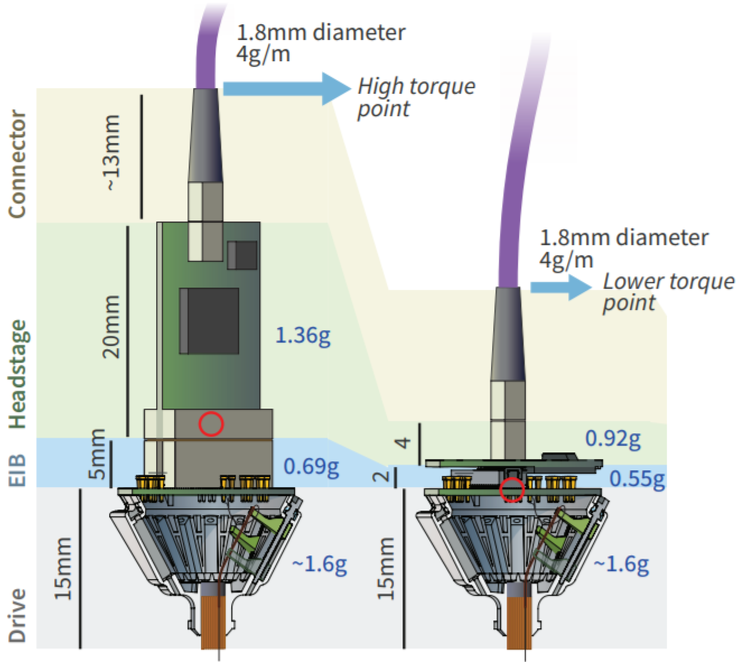

.. _headstages:
.. role:: raw-html-m2r(raw)
   :format: html

***********************************
Headstages
***********************************
Biologically generated signals typically have a very small amplitude, and are therefore easily lost due to electrical noise interference or the impedance of cables. The 'headstage' is the name of the hardware located closest to the subject of the experiment, which filters, amplifies, and digitizes the signal that was detected by the electrodes. This turns the tiny analog signal into a higher-amplitude digital signal that can travel over longer wires without suffering data loss. The FPGA inside the Acquisition Board drives the headstages, sending an SPI command to all attached headstages in order to sample the data they are receiving.

Headstages can be characterized by the number of channels they can record from (16,32,64,128...), their shape, and the type of connector they have. The relative importance of each will depend on the equipment you have and the experiment you want to perform.

Intan Headstages
###################################
All headstages sold by Intan that contain RHD2000-series chips are compatible with the Open Ephys Acquisition Board. For more information, see the `Intan website <https://intantech.com/RHD_headstages.html?tabSelect=RHD32ch&yPos=0>`_.

The channel map for the Intan RHD2132 is below:

|

.. image:: ../_static/images/usermanual/headstages/RHD2132_amp_board_electrode_connector_600.jpg

Low-profile SPI headstage
###################################

This a headstage designed by Open Ephys designed, which also uses an Intan chip. The main advantages of this headstage are:

- It has a thin Intan SPI tether
- It is compatible with Intan and Open Ephys data acquisition systems
- It uses a Hirose connector on the EIB, rather than an Omnetics connector, which greatly reduces cost
- It weighs 0.92 g
- It has 2 built-in LEDs for tracking purpose
- And, most importantly: the flat, round design means that the center of mass of the headstage is closer to the head of the animal. This cuts torque in half, reducing the impact on animal. Mice with this headstage can easily lower their heads and perform most licking/nosepoke paradigms. (Imagine wearing a heavy tall hat, and how that would influence your balance.)

Low-profile headstage channel map
***********************************

If you are using the low-profile Hirose SPI headstage, bought from Open Ephys Production site, use `this sheet <https://docs.google.com/spreadsheets/d/1WYDymxNqGRtFPxn69H9JzeMgePpXcFSPHiWJYBE0lu4/edit#gid=0>`__ to map your tetrodes to your software. It also includes the corresponding Hirose EIB (v.1.2) mapping. Using the classic Open Ephys Acquisition Board, channels will show up in software as if you sort the sheet by the Intan channel number.

|

*Left: Intan headstage with higher weight and torque; Right: Low-profile headstage*

Samtec/Mill-Max Headstage
###################################

Design files for a 32 channel RHD2132-based headstage using Samtec or Mill-Max 50 mil connectors can be found on `GitHub <https://github.com/open-ephys/headstage/tree/master/1x32_Samtec>`_. These headstages are designed so that the connector can soldered to the end of the PCB (avoiding the use of a surface mount 50 mil connector). Thus, the PCBs should be manufactured using slightly thinner than usual circuit board (~0.8 mm). A recommended manufacturer is the `Fusion PCB service <http://www.seeedstudio.com/depot/fusion-pcb-service-2-layers-p-835.html>`_, which can provide 10 PCBs for ~$2/ea. (Extra headstage PCBs may also be available from other users.)

The accelerometer, Intan RHD2132, and Omnetics connector should be soldered first. A solder mask stencil ($9 from http://www.oshstencils.com/) can be used to precisely locate solder paste, or it can be carefully applied with a fine tip. If a PCB oven is not available, a heat gun can be employed to reflow solder paste with satisfactory results. If using a heat gun, however, care must be taken not to damage the integrated circuits. Best practice is to observe the solder joints through a microscope while applying heat. The remaining components  (11 small (0603 or 0402) surface mount resistors, capacitors, and an LED) can then be soldered on by hand. Finally, the Samtec or Mill-Max connector can be soldered into place. A completed headstage is shown below. Note that after testing, the physical interface between PCB and Omnetics connector should be reinforced with epoxy.
