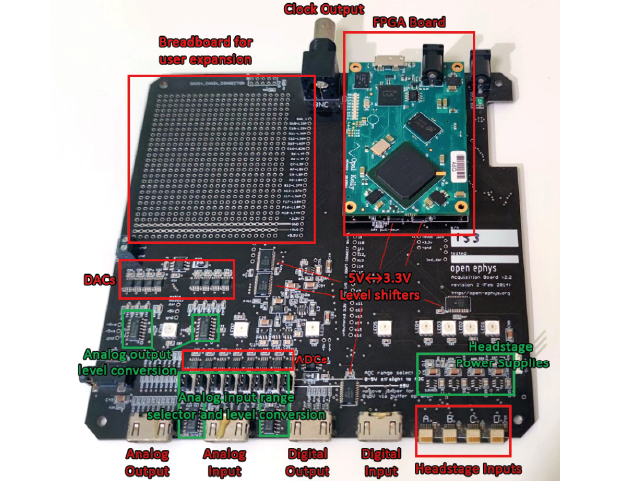

.. _peripheraldevices:
.. role:: raw-html-m2r(raw)
   :format: html

***********************************
Peripheral devices
***********************************

:ref:`Open Ephys I/O Board <ioboard>`

:ref:`Analog/Digital Inputs and Outputs <analogdigitalio>`

:ref:`Analog Output <analogout>`

:ref:`Analog Input <analogin>`

:ref:`Changing the Analog Input Range <analoginrange>`

:ref:`Digital Output <digitalout>`

:ref:`Digital Input <digitalin>`

:ref:`HDMI Breakout Boards <hdmibreakout>`

.. _ioboard:

Open Ephys I/O Board
###################################

To sync your neural data with external triggers, use an I/O board to connect up to 8 digital inputs to the acquisition board. Since its internal components are completely passive, the same I/O board can be also be used to relay digital outputs, analog inputs, and analog outputs. However, it can only perform one of these functions at a time, so you will need multiple I/O boards if you want to, for instance, receive both analog and digital inputs.

.. warning:: We use HDMI cables because they are convenient and cheap, but these are not real HDMI ports! Connecting real HDMI devices is likely to cause damage.

Specifications:

* 8 vertical BNC terminals

* HDMI type A connector

* 4.9" x 3.6" PCB

If you're interested in building your own I/O Board, follow the instructions :ref:`here <assemblingtheioboard>`.

.. _analogdigitalio:

Analog/Digital Inputs and Outputs
###################################

**ADC** = Analog to Digital converter. These are necessary to convert continuous signals arriving at our board into digital signals that are less sensitive to noise and can be read by the FPGA.

|

**DAC** = Digital to Analog converter. These are used to convert digital signals to analog, for instance if we want a channel of our electrophysiology recording (previously digitized in the headstage) to be played through a speaker.

.. _analogout:

Analog Output
*************************************
**Analog outputs are usually used to monitor headstage inputs, for instance by routing ephys channels to an audio output to detect spikes**

There are eight analog outputs on the board, which use the 16-bit DAC8531 chip from Texas Instruments. The DACs (Digital to Analog converters) are controlled by the Rhythm interface.

`If activated in the software <https://open-ephys.github.io/gui-docs/User-Manual/Plugins/Rhythm-FPGA.html#audio-output>`_ , the audio jack on the acquisition board can be used to monitor analog channels 0 and 1 (Left and Right in the audio) by plugging in headphones or speakers. (All channels can also be monitored via audio through the software, using the audio channel selector on a plugin to select the channel you're interested in).

Any of the channels can be programmed to deliver custom waveforms as well, but this functionality hasn't been added to the GUI yet.

.. _analogin:

Analog Input
*************************************
**Analog inputs are used for equipment that measures continuous signals, for instance a measurement distance or intensity. This could be anything from a power meter, thermometer, a running wheel, etc.**

There are eight analog inputs on the board, which use the 16-bit ADC161S262 chip from Texas Instruments. By sending this data to the acquisition board, the FPGA will timestamp the analog inputs using the same clock as the ephys data and can display the incoming data alongside your ephys.

.. _analoginrange:

Changing the Analog Input Range
---------------------------------------
The default setting is to have the ADCs run from -5 to +5V, although in practice the actual range is ±4.5V (up through Acquisition Board version 2.2). If you need to go up to 5V, the ADC must be switched to 0-5V mode. To switch the ADC range, open up the case of the acquisition board and move the jumpers near the ADC input HDMI (marked 'analog input range selector') to the two pins farther away from the edge of the board. Different channels can have different jumper settings, so make sure you record which is which! There's no way for the software to know the setting for each channel. Channel 1 is the rightmost jumper (closer to the headstage inputs), Channel 8 is the leftmost jumper.

There are three settings for the analog input:

- ±5V input sent through an op amp (jumper closer to the edge of the board)
- 0-5V input directly from the HDMI connector (jumper farther from the edge of the board)
- 0-5V input sent through an op amp (no jumper)

.. _digitalout:

Digital Output
*************************************
**Digital outputs are used to send high or low signals and are usually used to send pulses to trigger or synchronise device acquisition.**

The acquisition board has eight 5V digital outputs connected to an HDMI connector. These interface with a level shifter (Texas Instruments SN74LVC4245A) to allow the 3.3V outputs of the FPGA to send 5V signals out of the acquisition board. There are eight additional outputs in the Rhythm firmware, which are connected to holes on the bottom of the board.

.. note::
  Currently, the digital outputs of the Acquisition Board are not part of the Open Ephys GUI. Because the system has been designed to optimize the transfer of data from the board via USB to the pc (rather than in the opposite direction), the delay between the software and the acquisition board is, at the moment, variable and unpredictable. The digital outputs will be added to the next major release of the Open Ephys GUI.

In the meantime, we recommend using a microcontroller to send precisely timed TTL outputs to trigger external devices, as done :ref:`here <ephyswithbehaviouralcam>`. The Open Ephys GUI can communicate with microcontrollers through, for instance, the `Arduino Output <https://open-ephys.github.io/gui-docs/User-Manual/Plugins/Arduino-Output.html>`_ node.

.. _digitalin:

Digital Input
*************************************
**Digital inputs are used to synchronize acquisition across multiple tools.**

In contrast to the analog inputs, digital inputs can only receive 'high' or 'low' signals. Peripheral devices can send a short 'high' pulse every time they make a measurement. By sending that pulse to the acquisition board, the FPGA will timestamp the moment of the pulse using the same clock as the ephys data, allowing precise synchronization of the recordings. The acquisition board has eight 5V digital inputs connected to an HDMI connector. These interface with a level shifter (Texas Instruments SN74LVC4245A) to prevent 5V inputs from damaging the FPGA (which runs on a 3.3V supply). There are eight additional inputs that can be detected by the Rhythm firmware, which are connected to holes on the bottom of the board.

.. _hdmibreakout:

HDMI Breakout Boards
###################################
There are also a variety of simple HDMI breakout boards available from various vendors - these work equivalently as I/O boards. See for instance `here <https://elabbay.myshopify.com/collections/breadboard/products/elabguy-hdmi-af-bo-v1a-hdmi-type-a-female-socket-breakout-board>`__.

**HMDI channel mapping**:
| 1	DATA2+
| 2	DATA2–
| 3	DATA1+
| 4	DATA1–
| 5	DATA0+
| 6	DATA0–
| 7	CLOCK+
| 8	CLOCK–
