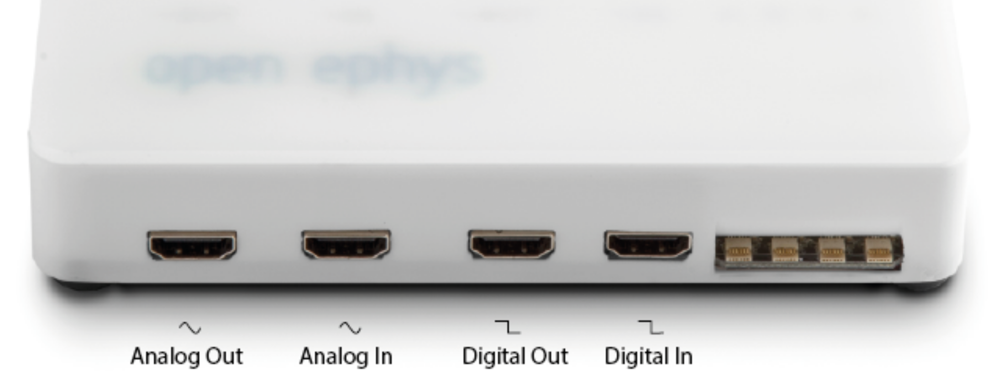

.. _quickstartguide:
.. role:: raw-html-m2r(raw)
   :format: html

***********************************
Quickstart Guide
***********************************

.. figure:: ../_static/images/usermanual/quickstart/complete_system.jpg
   :width: 80%
   :align: center

   An example acquisition system using the Acquisition Board, a low-profile headstage and a commutator, and without peripherals.

Installation
-------------------------------------------

The best way to start acquiring data with the Acquisition Board is by using the Open Ephys GUI. Follow the `Open Ephys GUI installation guide <https://open-ephys.github.io/gui-docs/User-Manual/Installing-the-GUI.html>`_.

The Open Ephys GUI installation includes the drivers required to use this board. If you run into issues, you can install the drivers separately by following :ref:`this page <drivers>`.

Connecting the headstages
-------------------------------------------

*Required components: RHD headstage, SPI cable*

There are four headstage ports on the front of the Acquisition Board. You can use any combination of the four (but you might as well start with input "A"). The connectors on the SPI cables are very small, so sometimes they can be tricky to insert. Make sure all contacts on both connectors are properly aligned before you apply pressure, otherwise you might break the connectors. When disconnecting, pull straight out from base of the connector.

Then, plug the opposite end of each SPI cable into a headstage. There are several more ways to configure this connection. For example, you can daisy-chain SPI cables to extend the tether or use a :ref:`dual headstage adapter <dual-hs-adapter>` to connect two headstages to the same port. You can read more about SPI cables and these configurations :ref:`here <2headstage>`.

..  image:: ../_static/images/usermanual/quickstart/spi_cable.jpg
    :width: 70%
    :align: center

Connecting peripheral devices
-------------------------------------------

*Required components: I/O Board, HDMI cable, external hardware*

External devices that generate digital or analog signals can interface with Open Ephys system through an I/O board. We use HDMI cables to connect to the I/O board, as these are inexpensive and have exactly the right number of shielded wires inside of them. Please note that these ports are not standard HDMI points; they will not work with any HDMI-compatible devices.

The I/O ports on the Acquisition Board are as follows:

.. note:: Other external hardware interfacing with the acquisition system can be directly connected to the PC for operation. Follow the connection guide for the specific piece of hardware. In the case of our SPI commutator, connect it to USB and connect the two SPI cables. You can find more information in its `connection guide <https://open-ephys.github.io/commutator-docs/index.html>`_.

Grounding your system
-------------------------------------------

*Required components: wire to be used for ground*

The Acquisition Board is referenced to your PC ground circuitry via the USB cable. To connect to this ground circuitry (for example, to use a Faraday cage), you can either:

- use the BNC connector at the back of the board. This is good for troubleshooting, since you can attach alligator clips quickly, but it invalidates the use of the BNC connector for its clock output function. It is also a less sturdy connection. If you use the BNC for grounding, be extra careful to attach your ground wire to the exterior shell, not the center pin.
  
- for a more permanent ground connection, you can attach a wire to one of the two dedicated screw terminals on the side of the board. For this, unscrew the four screws on the underside of the board, remove the cover, screw the ground wire into the terminal and replace the cover, making sure you screw it back in securely.

Connecting the USB cable and power supply
-------------------------------------------

*Required components: USB cable, 5V power supply*

Connect the board to a USB 3.0-compatible port on your computer using the high-speed USB cable provided. USB 3.0-compatible port are usually indicated by a blue color and are often at the back of PCs.

.. important:: Ensure you establish a reliable USB connection by using a high-speed USB cable and connecting directly to the port instead of through a hub or extension. USB cables longer than 2 meters are not recommended.

Connect the acquisition board to power using the original 5V, 2A power adapter provided.

.. warning:: Make sure you're using a 5V DC power supply! If your board has more than one power supply input jack, use the one on the main board and not on the FPGA module, as the main board has over-voltage protection circuitry.

Operation in the Open Ephys GUI
-------------------------------------------

This section provides the basic steps needed in the Open Ephys GUI to get started with your new system. In-depth `GUI documentation <https://open-ephys.github.io/gui-docs/>`_ is available and we highly recommend you familiarize yourself with it before starting experiments.

   An example signal chain in the Open Ephys GUI to acquire data with the Acquisition Board.

1. With the Acquisition Board plugged in, powered and connected to hardware as explained above, open the Open Ephys GUI.
2. Load the default configuration for the Acquisition Board from the pop-up, or build your own by dragging at least the following processors from the Processors list on the left of the GUI onto the Signal Chain at the bottom:
   
   - An `Acquisition Board processor <https://open-ephys.github.io/gui-docs/User-Manual/Plugins/Acquisition-Board.html>`_

   - An `LFP Viewer processor <https://open-ephys.github.io/gui-docs/User-Manual/Plugins/LFP-Viewer.html>`_
  
   - A `Record Node <https://open-ephys.github.io/gui-docs/User-Manual/Plugins/Record-Node.html>`_
  
   - (optional) A `Commutator Control processor <https://open-ephys.github.io/gui-docs/User-Manual/Plugins/Commutator-Control.html>`_ (downloaded using the Plugin Installer) to use the Open Ephys torque-free SPI Commutator

3. Click the Play button to start data acquisition. Click Record to record.
   
   The :ref:`statusleds` on the acquisition board will flash during normal operation. You can disable the Status LEDs if you'd like to perform experiments in the dark, or if they introduce noise in your recordings, by clicking the "LED" button in the Acquisition Board processor in the Open Ephys GUI.

4. Have fun experimenting!

Powering off the system
-------------------------------------------

The Acquisition Board does not have an on/off button. When you are done with acquisition, close the software and unplug the board from USB and power.